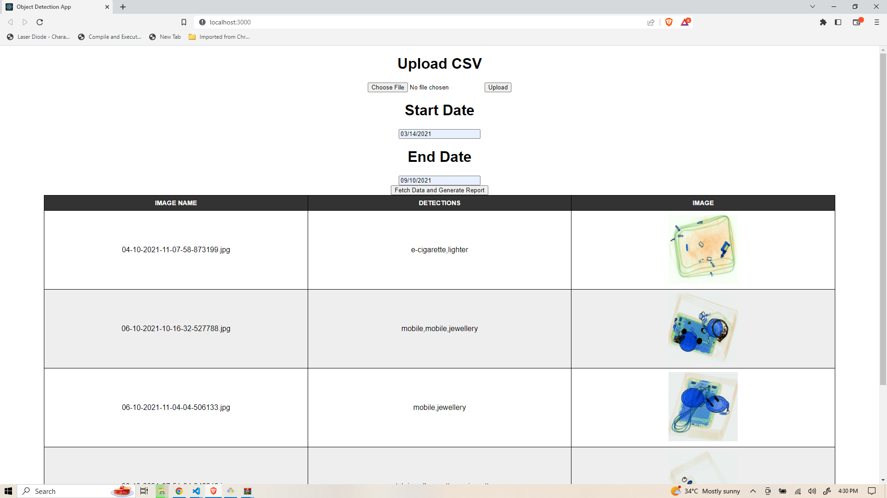
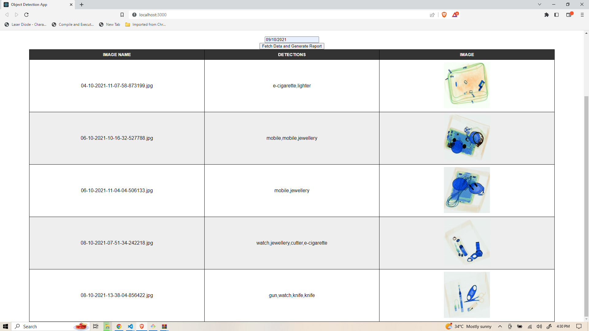

## Object Detection UI Frontend Using ReactJs


 ## Pre-requisites
- NodeJS should be installed on your system 
- npm and create-react-app should be installed  


## UI Screenshots




## How To Run App

- Clone Project from github repository :
  ```
     git clone https://github.com/manendranathshukla/objectdetection-frontend.git
     cd objectdetection-frontend
  ```

- Run below command to install dependencies 
  `
    npm install
  `
  
- Run the app using below command :
  `npm start`


